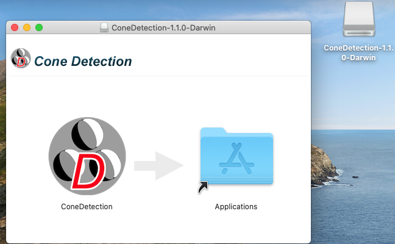

# Cone Detection
#### A software package for identifying cone photoreceptors in non-confocal adaptive optics images such as split detection, using an algorithm based on multiscale circular voting (MSCV) in combination with a priori knowledge that split detection images resemble Nomarski differential interference contrast images, in which dark and bright regions are present on the two sides of each cell.

*Jianfei Liu (NEI/NIH), Andrei Volkov (NEI/NIH Contractor), and Johnny Tam (NEI/NIH), with research support from the Intramural Research Program of the National Institutes of Health.*

### BibTeX

	@article{10.1167/iovs.16-21003,
	    author = {Liu, Jianfei and Jung, HaeWon and Dubra, Alfredo and Tam, Johnny},
	    title = "{Automated Photoreceptor Cell Identification on Nonconfocal Adaptive Optics Images Using Multiscale Circular Voting}",
	    journal = {Investigative Ophthalmology & Visual Science},
	    volume = {58},
	    number = {11},
	    pages = {4477-4489},
	    year = {2017},
	    month = {09},
	    issn = {1552-5783},
	    doi = {10.1167/iovs.16-21003},
	    url = {https://doi.org/10.1167/iovs.16-21003},
	    eprint = {https://arvojournals.org/arvo/content\_public/journal/iovs/936468/i1552-5783-58-11-4477.pdf},
	}


---------------

## Dependencies

This is a C++ project dependent on the following 3rd party open-source libraries:

- [Qt 5.15](https://www.qt.io/download-qt-installer)
- [VTK 8.2](https://www.vtk.org/files/release/8.2/VTK-8.2.0.zip)
- [ITK 4.13](https://github.com/InsightSoftwareConsortium/ITK/releases/download/v4.13.3/InsightToolkit-4.13.3.zip)

---------------

<a href="#mac">Skip to Mac OS instructions.</a>

## Setting up development environment (Windows x64)

1. Download and install required tools:
   - [MS Visual Studio 2019](https://visualstudio.microsoft.com/downloads/) (or higher) with C++ and Windows SDK
   - [CMake 3.22](https://cmake.org/download/) or higher
   - [NSIS 3.0](https://sourceforge.net/projects/nsis/) or higher

2. Download and install [Qt5 library](https://www.qt.io/download-qt-installer) (open source version). You will need to set up an account (username, email and password) with Qt. If asked, select “Open Source Download” (free). You can use the “recommended” online installer. Select a readily accessible “Installation Folder”, such as `C:\opt\Qt`.  You only need to check one of the latest “Qt 5.x, MSVC 2019 64-bit” options. On the "Select Components" page, check "Archive", uncheck everything else, and press "Filter". After the page refreshes, expand "Qt", "Qt 5.XX" and check the "MSVC 2019 64 bit" box, then press "Next".


3. Download and build [VTK 8.2](https://www.vtk.org/files/release/8.2/VTK-8.2.0.zip) . Create a readily accessible directory, such as `C:\opt\VTK`, and extract the zip file into it (the contents will go to `C:\opt\VTK\VTK-8.2.0`). Run CMake, select `C:/opt/VTK/VTK-8.2.0` as "source directory", set the "binaries" directory to `C:/opt/VTK/VTK-build`, then add the following entries:
```
  - Qt5_DIR [PATH] <path/to/qt5>/5.15.2/msvc2019_64/lib/cmake/Qt5
  - VTK_Group_Qt [BOOL] Checked
  - VTK_LEGACY_SILENT [BOOL] Checked
```
You should see a screen like this:


Click "Configure", then "Generate", then "Open Project". This will open MS Visual Studio. Switch the configuration from "Debug" to "Release", right-click on "ALL_BUILD", and select "Build". (The build process will take quite some time.)

4. Download and build [ITK 4.13](https://github.com/InsightSoftwareConsortium/ITK/releases/download/v4.13.3/InsightToolkit-4.13.3.zip) . Create a readily accessible directory, such as `C:\opt\ITK`, and extract the zip file into it (the contents will go to `C:\opt\ITK\InsightToolkit-4.13.3`). Run CMake, select `C:/opt/ITK/InsightToolkit-4.13.3` as "source directory", set the "binaries" directory to `C:/opt/ITK/ITK-build`, then add the following entries:
```
  - Qt5_DIR [PATH] <path/to/qt5>/5.15.2/msvc2019_64/lib/cmake/Qt5
  - VTK_DIR [PATH] <path/to/vtk/build>
  - Module_ITKV3Compatibility [BOOL] Checked
  - ITKV3_COMPATIBILITY [BOOL] Checked
  - Module_ITKVtkGlue [BOOL] Checked
```
You should see a screen like this:


Click "Configure", then "Generate", then "Open Project". This will open MS Visual Studio. Switch the configuration from "Debug" to "Release", right-click on "ALL_BUILD", and select "Build". (The build process will take quite some time.)

5. Check out "ConeDetection" into a local directory, such as "C:\AO\ConeDetection", then run CMake. Set source directory to `C:/AO/ConeDetection`, binaries directory, to `C:/AO/ConeDetection/build`, then add the following entries:
```
  - Qt5_DIR [PATH] <path/to/qt5>/5.15.2/msvc2019_64/lib/cmake/Qt5
  - VTK_DIR [PATH] <path/to/vtk/build>
  - ITK_DIR [PATH] <path/to/itk/build>
```
You should see a screen like this:


Click "Configure", then "Generate", then "Open Project". This will open MS Visual Studio. Switch the configuration from "Debug" to "Release", right-click on "ALL_BUILD", and select "Build". If the build is successful, the result is `C:/AO/ConeDetection/build/Release/ConeDetection.exe`. The `C:/AO/ConeDetection/build/Release` directory contains all files necessary to run the application. To build the distribution executable, right-click on "PACKAGE" and select "Build". The result is the `C:/AO/ConeDetection/build/ConeDetection-{version}-win64.exe` Windows installer, which can be distributed to other systems.

<a name="mac"></a>
## Setting up development environment (Mac OS)

1. Download and install required tools:
   - Xcode (via App Store)
   - [CMake 3.22](https://cmake.org/download/) or higher

2. Download and install [Qt5 library](https://www.qt.io/download-qt-installer) (open source version). You will need to set up an account (username, email and password) with Qt. If asked, select “Open Source Download” (free). You can use the “recommended” online installer. Select a readily accessible “Installation Folder”, such as `/Users/Shared/opt/Qt`.  You only need to check one of the latest “Qt 5.x, macOS” options. On the "Select Components" page, check "Archive", uncheck everything else, and press "Filter". After the page refreshes, expand "Qt", "Qt 5.XX" and check the "macOS" box, then press "Next".


3. Download and build [VTK 8.2](https://www.vtk.org/files/release/8.2/VTK-8.2.0.zip) . Create a readily accessible directory, such as `/Users/Shared/opt/VTK`, and extract the zip file into it (the contents will go to `/Users/Shared/opt/VTK/VTK-8.2.0`). Run CMake, select `/Users/Shared/opt/VTK/VTK-8.2.0` as "source directory", set the "binaries" directory to `/Users/Shared/opt/VTK/VTK-build`, then add the following entries:
```
  - Qt5_DIR [PATH] <path/to/qt5>/5.15.2/clang_64/lib/cmake/Qt5
  - VTK_Group_Qt [BOOL] Checked
  - VTK_LEGACY_SILENT [BOOL] Checked
```
You should see a screen like this:


**Note that BUILD_SHARED_LIBS is unchecked, unlike in Windows environment.**

Click "Configure", then "Generate" (keep Xcode as compiler), then "Open Project". This will open Xcode. When asked about “Autocreate Schemes”, select “Automatically Create Schemes”. Make sure "ALL_BUILD" is the selected target. Go to the menu “Product” -> “Scheme” -> “Edit Scheme…” and switch “Run” to “Release”. Click “Close”, then start building the project via menu “Project” -> “Build For” -> “Running”.

4. Download and build [ITK 4.13](https://github.com/InsightSoftwareConsortium/ITK/releases/download/v4.13.3/InsightToolkit-4.13.3.zip) . Create a readily accessible directory, such as `/Users/Shared/opt/ITK`, and extract the zip file into it (the contents will go to `/Users/Shared/opt/ITK/InsightToolkit-4.13.3`). Run CMake, select `/Users/Shared/opt/ITK/InsightToolkit-4.13.3` as "source directory", set the "binaries" directory to `/Users/Shared/opt/ITK/ITK-build`, then add the following entries:
```
  - Qt5_DIR [PATH] <path/to/qt5>/5.15.2/clang_64/lib/cmake/Qt5
  - VTK_DIR [PATH] <path/to/vtk/build>
  - Module_ITKV3Compatibility [BOOL] Checked
  - ITKV3_COMPATIBILITY [BOOL] Checked
  - Module_ITKVtkGlue [BOOL] Checked
```
You should see a screen like this:


Click "Configure", then "Generate", then "Open Project". This will open Xcode. In Xcode, make sure “ALL_BUILD” is selected in the “current active scheme” box. Go to the menu “Product” -> “Scheme” -> “Edit Scheme…” and switch “Run” to “Release”. Click “Close”, then start building the project via menu “Project” -> “Build For” -> “Running”. 

5. Check out "ConeDetection" into a local directory, such as `/Users/Shared/ConeDetection`, then run CMake. Set source directory to `/Users/Shared/ConeDetection`, binaries directory, to `/Users/Shared/ConeDetection/build`, then add the following entries:
```
  - Qt5_DIR [PATH] <path/to/qt5>/5.15.2/clang_64/lib/cmake/Qt5
  - VTK_DIR [PATH] <path/to/vtk/build>
  - ITK_DIR [PATH] <path/to/itk/build>
```
You should see a screen like this:


Click "Configure", then "Generate", then "Open Project". This will open Xcode. In Xcode, go to menu “Product” -> “Scheme” -> “Edit Scheme…”, switch the “Run” mode for schemes “ALL_BUILD”, “install” and “package” to the “Release” configuration. Use the scheme selector in the top left corner of the dialog to switch between schemes. Click “Close”, switch scheme to “ALL_BUILD”, and build the project via menu Product -> Build For -> Running. This should generate an executable app `/Users/Shared/ConeDetection/build/Release/ConeDetection.app`.
You can test the app, and if everything is OK, go back to Xcode, switch scheme to “package” and build again. While building “package” Xcode may ask you to grant permission to access “Finder” – say “Yes”, since a part of the building process is configuring the appearance of the package using Finder. You will see opening and closing Finder windows with the ConeDetection icon inside during the process. Once it is done, you can find the final distribution package `/Users/Shared/ConeDetection/build/ConeDetection-{version}-Darwin.dmg`. This file can be distributed to other computers. 

To install ConeDetection on a different Mac computer, transfer the `ConeDetection-{version}-Darwin.dmg` to that computer and double-click on it. Accept the license agreement, then you should see a screen like this:



You can run the application right away by double clicking on the icon, but a better idea may be to drag it over the "Applications" folder (which is just a symbolic link to local "Applications" folder). Once ConeDetection in "Applications", you can eject the mounted volume and delete the `ConeDetection-{version}-Darwin.dmg` file.
 

